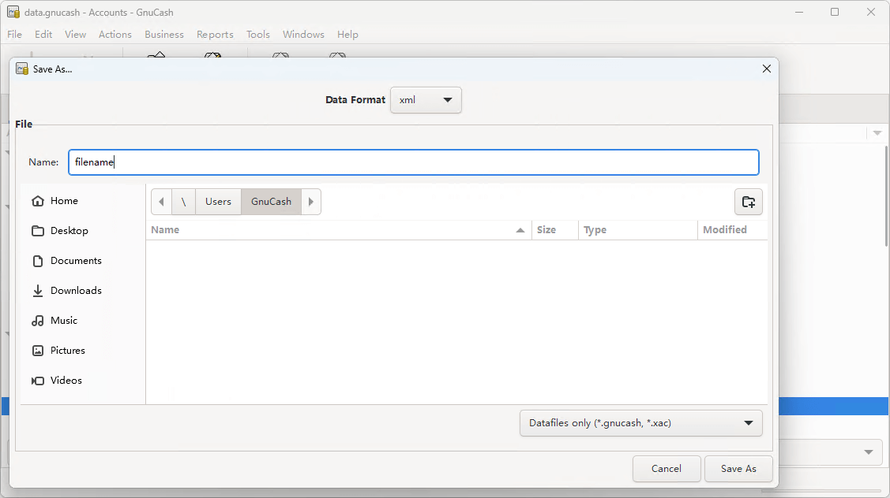

# Export & Import
{: .no_toc }

## Table of contents
{: .no_toc .text-delta }

1. TOC
{:toc}

---

## Export Transactions

ezBookkeeping supports exporting transaction data as CSV (Comma-Separated Values) or TSV (Tab-Separated Values) files, via the command line or from the user interface.

### Export Transactions via Command Line

See [transaction-export](/command_line#userdata)

### Export Transactions from desktop user interface

1. Click "Data Management" in "User Settings" page
2. Click the "Export Data" button and select the file type to export all transactions into the chosen file format

### Export Transactions from mobile user interface

1. Tap "Data Management" in "Settings" page
2. Tap the "Export Data" button and select the file type to export all transactions into the chosen file format

## Import Transactions

ezBookkeeping supports importing files exported by ezBookkeeping via the command line, as well as importing various types of transaction data files from the desktop user interface. The transaction data import tool in the desktop version allows you to preview the imported data and perform batch modifications.

### Import Transactions via Command Line

See [transaction-import](/command_line#userdata)

### Import Transactions from desktop user interface

1. Click "Import" in "Transaction Details" page
2. Select the file type and the file you want to import, then click the "Next" button
3. Check if the imported transactions are mapped to existing transaction categories, accounts, and tags. Invalid data will be highlighted in red. You can click the pen icon on the left side of each record to modify the transaction category, account or tag of this transaction. You can also click the menu in the upper right corner to batch replace transaction categories, accounts or tags. Finally, select the transactions you want to import by checking the box on the left side, then click the "Import" button.

The following table lists all supported file types and the data contents that can be imported:

| File Type | Income Transaction | Expense Transaction | Transfer Transaction | Transfer Transaction With Different Currencies | Split Transaction | Category Name | Account Name | Tag Names | Timezone | Geographic Location | Description |
| --- | --- | --- | --- | --- | --- | --- | --- | --- | --- | --- | --- |
| ezbookkeeping Data Export File | √ | √ | √ | √ | - | √ | √ | √ | √ | √ | √ |
| Open Financial Exchange (OFX) File | √ | √ | √ | - | - | - | - | - | √ | - | √ |
| Quicken Financial Exchange (QFX) File | √ | √ | √ | - | - | - | - | - | √ | - | √ |
| Quicken Interchange Format (QIF) File | √ | √ | √ | - | × | √ | √ | - | - | - | √ |
| Intuit Interchange Format (IIF) File | √ | √ | √ | - | √ (*1) | √ | √ | - | - | - | √ |
| GnuCash XML Database File | √ | √ | √ | √ | × | √ | √ | - | √ | - | √ |
| Firefly III Data Export File | √ | √ | √ | √ | - | √ | √ | √ | √ | - | √ |
| Feidee MyMoney (App) Data Export File | √ | √ | √ | √ | - | √ | √ | - | - | - | √ |
| Feidee MyMoney (Web) Data Export File | √ | √ | √ | - | - | √ | √ | - | - | - | √ |
| Alipay (App) Transaction Flow File | √ | √ | √ | - | - | √ | √ | - | - | - | √ |
| Alipay (Web) Transaction Flow File | √ | √ | √ | - | - | - | √ | - | - | - | √ |
| WeChat Pay Billing File | √ | √ | √ | - | - | √ | √ | - | - | - | √ |

* "√" means that the original file contains this data, and it can be imported
* "-" means that the original file does not contain this data
* "×" means that the original file contains this data, but it cannot be imported
* \*1: Split transactions will be converted into separate transactions

### How to get GnuCash XML Database File

1. Click the "File" menu and select "Save As"
2. Select "xml" in "Data Format", and save to export the GnuCash database in XML format

### How to get Firefly III Data Export File

1. Click "Export data" in the left navigation bar of Firefly III
2. Click "Export all transactions" to export to a csv file
