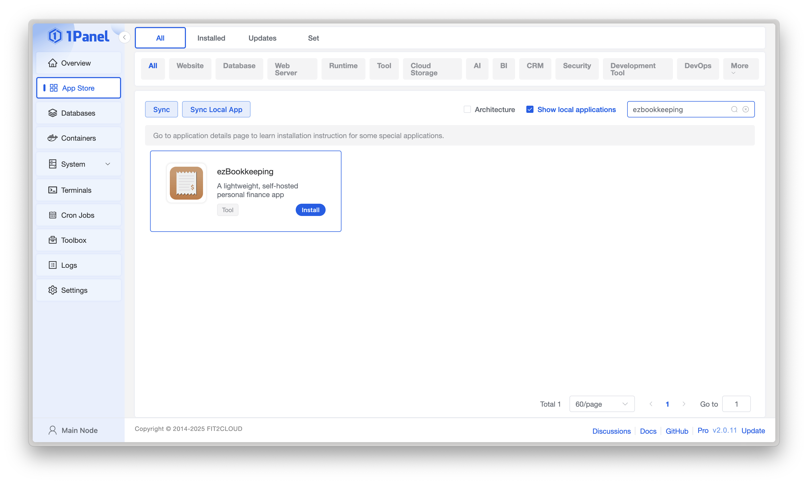
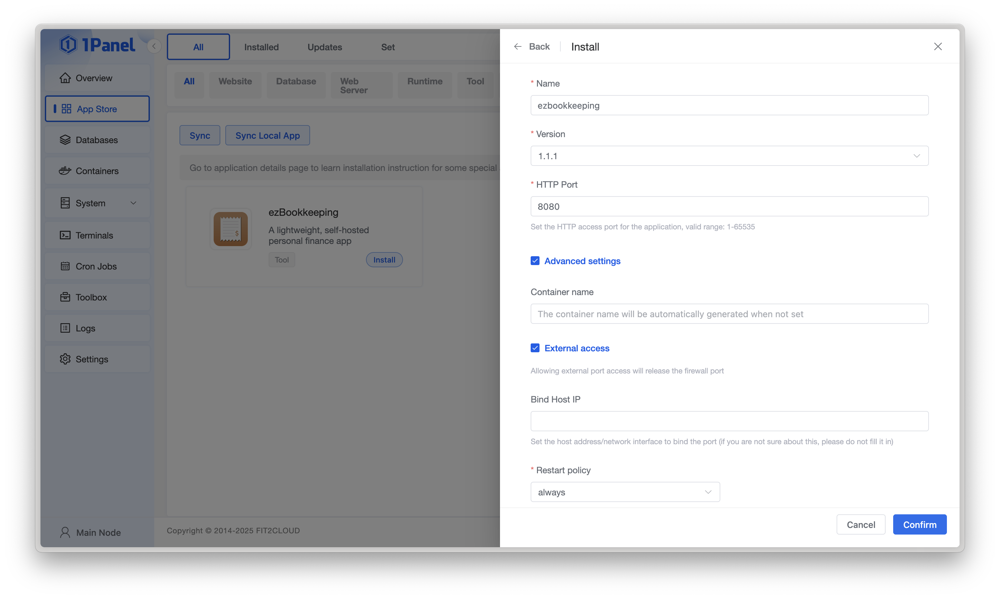

# Installation
{: .no_toc }

## Table of contents
{: .no_toc .text-delta }

1. TOC
{:toc}

---

## Ship with docker
Visit [Docker Hub](https://hub.docker.com/r/mayswind/ezbookkeeping) to see all images and tags.

**Latest release image**

[](https://hub.docker.com/r/mayswind/ezbookkeeping)

    mayswind/ezbookkeeping:latest

**Release image with specific version**

    mayswind/ezbookkeeping:{version}  

**Latest snapshot image**

    mayswind/ezbookkeeping:latest-snapshot

### Run docker image

Example:

    $ docker run -d -p8080:8080 --name ezbookkeeping mayswind/ezbookkeeping

After executing this command, ezBookkeeping will use the default configuration to run in backend, and listen on port `8080`. 

The default paths in container:

* **Configuration File**: `/ezbookkeeping/conf/ezbookkeeping.ini`
* **Database File (for `sqlite3` database)**: `/ezbookkeeping/data/ezbookkeeping.db`
* **Log File**: `/ezbookkeeping/log/ezbookkeeping.log`
* **Object Storage Root Path (for `local_filesystem` object storage)**: `/ezbookkeeping/storage/`

### Store data persistently

The default database type is `sqlite3`, and the database file is stored in `/ezbookkeeping/data/ezbookkeeping.db` in container.  
If you want to continue to use `sqlite3` as database and store these data persistently, you can use Docker persistent volume or mount a host path to container.  
In addition, the default object storage uses the local file system, and the default path is `/ezbookkeeping/storage/`. If you use the local file system to store object data (e.g. pictures uploaded by users), you also need to use Docker persistent volume or mount a host path to container.  

#### Run container with persistent volume

    # Create persistend volume
    $ docker volume create ezbookkeeping-data
    $ docker volume create ezbookkeeping-storage

    # Run container with persistent volume
    $ docker run -d -p8080:8080 --name ezbookkeeping -v ezbookkeeping-data:/ezbookkeeping/data -v ezbookkeeping-storage:/ezbookkeeping/storage mayswind/ezbookkeeping

#### Run container with mounting host path

    # Create data directory and modify UID/GID in host
    $ mkdir -p /var/lib/ezbookkeeping/data
    $ mkdir -p /var/lib/ezbookkeeping/storage
    $ chown 1000:1000 /var/lib/ezbookkeeping/data
    $ chown 1000:1000 /var/lib/ezbookkeeping/storage

    # Run container with mounting host path
    $ docker run -d -p8080:8080 --name ezbookkeeping -v /var/lib/ezbookkeeping/data:/ezbookkeeping/data -v /var/lib/ezbookkeeping/storage:/ezbookkeeping/storage mayswind/ezbookkeeping

The user id (UID) and group id (GID) used for running ezBookkeeping is both `1000`, so you should make sure the directories ezBookkeeping use can be read or write by UID/GID `1000` when you want to change directories or mount volumes.

### Customize configuration

If you want to replace the configuration file, you can mount the custom configuration file to `/ezbookkeeping/conf/ezbookkeeping.ini`, or change the configuration path by environment variable `EBK_CONF_PATH`.

If you just want to modify some options, you can just use environment variable to set these value.
All options in the configuration file can be overridden using environment variables with the following name:
`EBK_{SECTION_NAME}_{OPTION_NAME}`.

**ATTENTION**:  
Before you deploy to production, you must generate a random string and set it to `secret_key` to keep your user data safe. You can get a random secret key by executing `ezbookkeeping security gen-secret-key`.

In addition, you also need to set the `domain` in the settings to the domain name you actually access, otherwise the url in the email, as well as the user avatar, transaction picture and other url will be incorrect. If the protocol or port you actually access is different from the ezBookkeping configuration, you also need to modify `root_url` to the actual access address (for example, using Nginx as the reverse proxy).

For more information, please visit [Configuration](/configuration).

### Use docker-compose

A full production deployment example (using `mysql` as database):

```
version: "2"
services:
  ezbookkeeping:
    image: mayswind/ezbookkeeping
    container_name: ezbookkeeping
    hostname: "ezbookkeeping"
    ports:
      - "8080:8080"
    environment:
      - "EBK_SERVER_DOMAIN=ezbookkeeping.yourdomain"
      - "EBK_SERVER_ENABLE_GZIP=true"
      - "EBK_DATABASE_TYPE=mysql"
      - "EBK_DATABASE_HOST=mysql:3306"
      - "EBK_DATABASE_NAME=ezbookkeeping"
      - "EBK_DATABASE_USER=ezbookkeeping"
      - "EBK_DATABASE_PASSWD=ezbookkeeping"
      - "EBK_LOG_MODE=file"
      - "EBK_SECURITY_SECRET_KEY=its_should_be_a_random_string"
    volumes:
      - "/etc/localtime:/etc/localtime:ro"
      - "/var/lib/ezbookkeeping/storage:/ezbookkeeping/storage" # make sure the UID:GID is 1000:1000
      - "/var/log/ezbookkeeping:/ezbookkeeping/log" # make sure the UID:GID is 1000:1000
```

If you're interested, you can take a look at the [docker-compose file](demo/docker-compose.yml) and [nginx configuration file](demo/ezbookkeeping.demo.conf) behind [https://ezbookkeeping-demo.mayswind.net](https://ezbookkeeping-demo.mayswind.net).

### Installing with 1Panel

> For 1Panel installation instructions, see [https://1panel.cn/docs/v2/installation/online_installation/](https://1panel.cn/docs/v2/installation/online_installation/).

#### Installing ezBookkeeping

Log in to 1Panel, go to the "App Store:", search for "ezBookkeeping", and click "Install".



> During installation, configure the following parameters according to your needs:
>
> * "Version": Choose the latest stable version
> * "HTTP Port": Default is `8080`, can be changed if needed
> * "Advanced Settings": Optionally enable "External Port Access"
>
> You can complete the installation using the "default configuration", or adjust it as required.



The ezBookkeeping instance installed via 1Panel uses `sqlite3` as its database and is fully configured through the `ezbookkeeping.ini` configuration file.

The configuration file is located in the `conf` folder within the application’s installation directory.
For more information, please visit the [Configuration](/configuration) page.

#### Using ezBookkeeping

After installation, go to the "Installed Apps" page and click "Open" to access the ezBookkeeping "WebUI".

> Before using, it is recommended to set the "default access address" in the "Panel Settings" page.

## Install from binary
Latest release: 

[](https://github.com/mayswind/ezbookkeeping/releases)

Download and extract the package, and execute the following command:

    $ ./ezbookkeeping server run

After executing this command, ezBookkeeping will startup with the default configuration, and listen on port `8080`. If you want to modify configurations, you can use `--conf-path` parameter to specify a custom configuration path or you can modify `conf/config.ini` file directly. For more information, please visit [Configuration](/configuration).

If you have `systemd` and you want to use `systemd` to manage ezBookkeeping, you can create a service unit configuration in `/lib/systemd/system` (Debian/Ubuntu) or `/usr/lib/systemd/system` (CentOS). For example, you can download the [Sample Configuration](https://github.com/mayswind/ezbookkeeping/blob/main/etc/systemd/ezbookkeeping.service) to `/lib/systemd/system/ezbookkeeping.service`, and create a user and a group named `ezbookkeeping`, and modify the path in the configuration according to the actual path.

Then you can start ezBookkeeping by following command:

    $ systemctl start ezbookkeeping

And make ezBookkeeping automatically starts on boot:

    $ systemctl enable ezbookkeeping

## Reverse proxy configuration
If you want to use Nginx as the reverse proxy, you can refer to the following configuration. For more information about Nginx, please refer to [Nginx documentation](https://nginx.org/en/docs/).

### ezBookkeeping in the ROOT path of domain

```
upstream ezbookkeeping-upstream {
    server 127.0.0.1:8080;
}

server {
    listen 80;
    listen [::]:80;
    server_name ezbookkeeping.yourdomain;

    return 301 https://$server_name$request_uri;
}

server {
    listen 443      ssl;
    listen [::]:443 ssl;
    server_name ezbookkeeping.yourdomain;

    location / {
        proxy_pass http://ezbookkeeping-upstream;

        proxy_redirect   off;
        proxy_set_header Host            $host;
        proxy_set_header X-Real-IP       $remote_addr;
        proxy_set_header X-Real-Port     $remote_port;
        proxy_set_header X-Forwarded-For $proxy_add_x_forwarded_for;
    }
}
```

### ezBookkeeping in the sub path of domain (e.g. `/ezbookkeeping`)

```
upstream ezbookkeeping-upstream {
    server 127.0.0.1:8080;
}

server {
    listen 80;
    listen [::]:80;
    server_name yourdomain;

    location /ezbookkeeping {
        return 301 https://$server_name$request_uri;
    }
}

server {
    listen 443      ssl;
    listen [::]:443 ssl;
    server_name yourdomain;

    location /ezbookkeeping {
        rewrite ^/ezbookkeeping/(.*) /$1 break;
        proxy_pass http://ezbookkeeping-upstream;

        proxy_redirect   off;
        proxy_set_header Host            $host;
        proxy_set_header X-Real-IP       $remote_addr;
        proxy_set_header X-Real-Port     $remote_port;
        proxy_set_header X-Forwarded-For $proxy_add_x_forwarded_for;
    }
}
```

In addition, if you want to access ezBookkeeping via sub path, you also need to set the `root_url` option in the [configuration](/configuration), for example, it needs to be set to `https://%(domain)s:{your_nginx_port}/ezbookkeeping/`.
