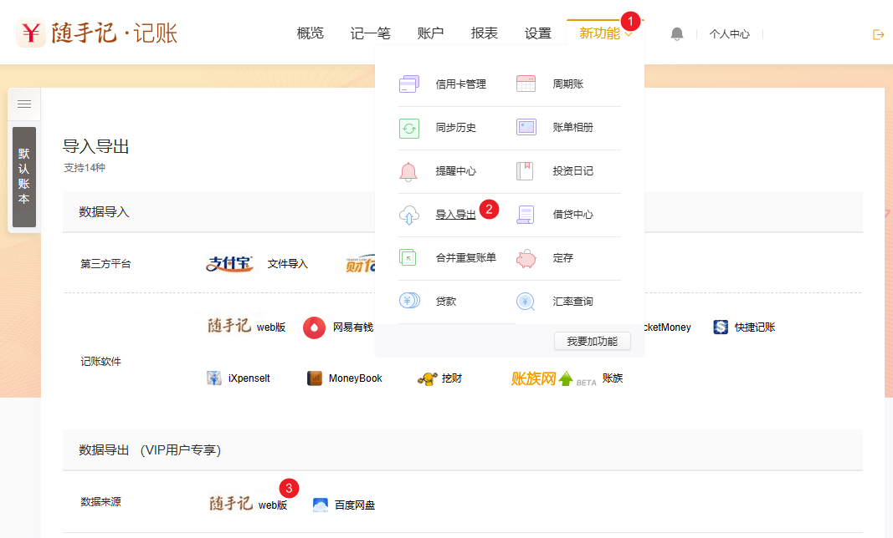
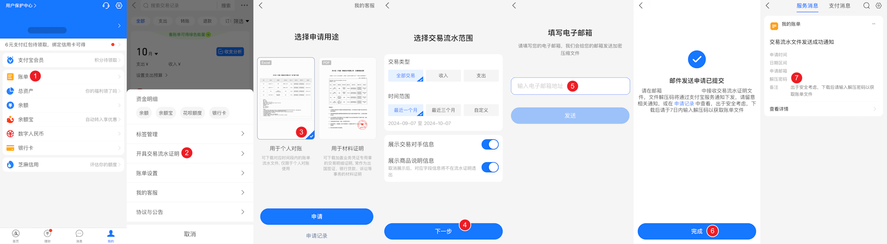

# 导出 & 导入
{: .no_toc }

## 目录
{: .no_toc .text-delta }

1. TOC
{:toc}

---

## 导出交易

ezbookkeeping 支持使用命令行或从用户界面中导出交易数据为 CSV（Comma-separated values）或 TSV（Tab-separated values）格式的文件。

### 通过命令行导出交易

详见 [transaction-export](/command_line#userdata)

### 从桌面版用户界面导出交易

1. 在 “用户设置” 页面中点击 “数据管理”
2. 点击 “导出数据” 按钮，选择文件类型即可导出所有交易到指定类型的文件中

### 从移动版用户界面导出交易

1. 在 “设置” 页面中轻触 “数据管理”
2. 轻触 “导出数据” 按钮，选择文件类型即可导出所有交易到指定类型的文件中

## 导入交易

ezbookkeeping 支持使用命令行导入 ezbookkeeping 导出的文件，或从桌面版用户界面中导入多种类型的交易数据文件，同时桌面版提供的交易数据导入工具支持预览导入的数据以及批量对导入的数据进行修改。

### 通过命令行导入交易

详见 [transaction-import](/command_line#userdata)

### 从桌面版用户界面导入交易

1. 在 “交易详情” 页面中点击 “导入” 按钮
2. 选择要导入文件的类型和文件，然后点击 “下一步” 按钮
3. 检查导入的交易是否映射到已经创建的分类、账户和标签，无效的数据将会标红显示。您可以点击每条记录左侧的笔形状的图标修改这条交易的分类、账户或标签。您还可以点击右上角的菜单，批量替换分类、账户或标签。最后点击交易左侧的复选框，选择最终要导入的交易，然后点击 “导入” 按钮即可

下表列出了所有支持导入的文件类型以及支持导入的数据内容：

| 文件类型 | 收入交易 | 支出交易 | 转账交易 | 不同货币的转账交易 | 拆分交易 | 分类名 | 账户名 | 标签名 | 时区 | 地理位置 | 描述 |
| --- | --- | --- | --- | --- | --- | --- | --- | --- | --- | --- | --- |
| ezbookkeeping 数据导出文件 | √ | √ | √ | √ | - | √ | √ | √ | √ | √ | √ |
| 开放式金融交换 (OFX) 文件 | √ | √ | √ | - | - | - | - | - | √ | - | √ |
| Quicken Financial Exchange (QFX) 文件 | √ | √ | √ | - | - | - | - | - | √ | - | √ |
| Quicken Interchange Format (QIF) 文件 | √ | √ | √ | - | × | √ | √ | - | - | - | √ |
| Intuit Interchange Format (IIF) 文件 | √ | √ | √ | - | √ (*1) | √ | √ | - | - | - | √ |
| GnuCash XML 数据库文件 | √ | √ | √ | √ | × | √ | √ | - | √ | - | √ |
| Firefly III 数据导出文件 | √ | √ | √ | √ | - | √ | √ | √ | √ | - | √ |
| 随手记 (App) 数据导出文件 | √ | √ | √ | √ | - | √ | √ | - | - | - | √ |
| 随手记 (Web版) 数据导出文件 | √ | √ | √ | - | - | √ | √ | - | - | - | √ |
| 支付宝 (App) 交易流水文件 | √ | √ | √ | - | - | √ | √ | - | - | - | √ |
| 支付宝 (网页版) 交易流水文件 | √ | √ | √ | - | - | - | √ | - | - | - | √ |
| 微信支付账单文件 | √ | √ | √ | - | - | √ | √ | - | - | - | √ |

* “√” 表示原始文件包含该数据，同时该数据可以被导入
* “-” 表示原始文件不包含该数据
* “×” 表示原始文件包含该数据，但该数据不支持被导入

* *1: 拆分交易将转换为独立的交易

### 如何获取 GnuCash XML 数据库文件

1. 点击 “文件” 菜单，选择 “另存为”
2. 选择 “数据格式” 中的 “xml”，保存即可导出 XML 格式的 GnuCash 数据库

### 如何获取 Firefly III 数据导出文件

1. 在 Firefly III 左侧导航栏中点击 “导出数据”
2. 点击 “导出所有交易” 即可导出为 csv 格式的文件

### 如何获取随手记（App）数据导出文件

1. 在随手记App选择账本后点击 “设置”，然后点击 “高级功能”
2. 在新的页面中点击 “备份与同步”
3. 在新的页面中点击 “备份与恢复”
4. 在新的页面中点击 “本地备份与恢复”
5. 在新的页面中点击 “导出Excel文件(CSV)” 即可导出为 csv 格式的文件

> 注意：随手记 iPhone App 导出的交易数据中没有正确处理交易备注中的换行符，如果交易备注中包含换行符，导入 ezbookkeeping 将会失败。如果存在该问题，可以使用随手记 Android App 导出交易数据，然后再导入到 ezbookkeeping。

### 如何获取随手记（Web版）数据导出文件

1. 在随手记网页版点击 “新功能” 菜单
2. 在弹出的菜单中点击 “导入导出”
3. 点击 “数据导出” 下方数据来源的 “随手记 web版”，即可导出为 Excel（.xls）格式的文件

> 注意：随手记（Web版）导出的转账交易数据中没有正确处理跨币种的转账交易数据，跨币种的转账交易只有一个金额。如果您要导入的数据中包含跨币种的转账交易，请使用随手记手机App导出交易数据，然后再导入到 ezbookkeeping。

### 如何获取支付宝（App）交易流水文件

1. 在支付宝App选择 “我的”，然后点击 “账单”
2. 在新的页面中点击右上角打开菜单，然后选择 “开具交易流水证明”
3. 在新的页面中选择 “用于个人对账”，然后点击 “申请”
4. 在新的页面中设置导出的交易时间范围，然后点击 “下一步”
5. 在新的页面中输入要接收导出数据的电子邮箱地址，然后点击 “发送”
6. 若上一步提交成功，会在新的页面提示申请已提交，然后点击 “完成”
7. 打开第5步填写的邮箱，下载由支付宝发送的导出数据 zip 压缩文件。然后返回支付宝App首页，选择 “消息”，在 “服务消息” 中可以查看该压缩文件的密码，使用该密码解压缩后即为导出的 csv 格式文件

### 如何获取支付宝（网页版）交易流水文件

1. 登录网页版支付宝后，点击 “查看所有交易记录”
2. 选择要导出的时间范围
3. 点击 “下载查询结果” 即可导出 zip 格式的压缩文件，解压缩后即为 csv 格式的文件

### 如何获取微信支付账单文件

1. 在微信App选择 “我”，然后点击 “服务”
2. 在新的页面中点击“钱包”
3. 在新的页面中点击右上角的“账单”
4. 在新的页面中点击右上角的“常见问题”
5. 在新的页面中点击“下载账单”
6. 在新的页面中点击 “用于个人对账”
7. 在新的页面中设置导出的交易时间范围，然后点击 “下一步”
8. 在新的页面中输入要接收导出数据的电子邮箱地址，然后点击 “下一步”
9. 若上一步提交成功，会在新的页面提示申请已提交，然后点击 “完成”
10. 打开第8步填写的邮箱，下载由微信支付发送的导出数据 zip 压缩文件。然后返回微信App首页，找到 “微信支付” 发送的消息，即可查看该压缩文件的密码，使用该密码解压缩后即为导出的 csv 格式文件
