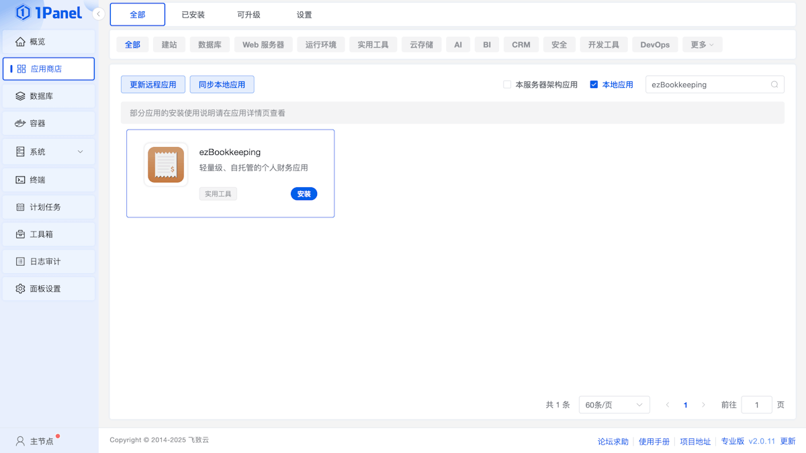
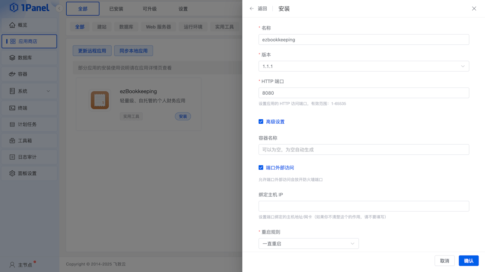

# 安装
{: .no_toc }

## 目录
{: .no_toc .text-delta }

1. TOC
{:toc}

---

## 使用 Docker 部署
访问 [Docker Hub](https://hub.docker.com/r/mayswind/ezbookkeeping) 查看所有镜像和标签。

**最近发布镜像**

[](https://hub.docker.com/r/mayswind/ezbookkeeping)

    mayswind/ezbookkeeping:latest

**指定版本的发布镜像**

    mayswind/ezbookkeeping:{version}  

**最近每日构建镜像**

    mayswind/ezbookkeeping:latest-snapshot

### 启动 Docker 镜像

示例：

    $ docker run -d -p8080:8080 --name ezbookkeeping mayswind/ezbookkeeping

执行完该命令后，ezBookkeeping 将会使用默认的配置在后台启动，并监听端口 `8080`。 

容器中的默认路径：

* **配置文件**：`/ezbookkeeping/conf/ezbookkeeping.ini`
* **数据库文件（使用 `sqlite3` 数据库）**：`/ezbookkeeping/data/ezbookkeeping.db`
* **日志文件**：`/ezbookkeeping/log/ezbookkeeping.log`
* **对象存储根路径（使用 `local_filesystem` 对象存储）**: `/ezbookkeeping/storage/`

### 持久化存储数据

默认数据库类型是 `sqlite3`，数据库文件存储在容器中的 `/ezbookkeeping/data/ezbookkeeping.db`。  
如果你想继续使用 `sqlite3` 作为数据库，并持久化保存这些数据，你需要使用 Docker 持久化数据卷或挂载宿主机的路径到容器内。  
此外，默认对象存储使用本地文件系统，默认路径是 `/ezbookkeeping/storage/`，如果你使用本地文件系统存储对象数据（例如用户上传的图片），你也需要使用 Docker 持久化数据卷或挂载宿主机的路径到容器内。  

#### 使用持久化数据卷运行容器

    # 创建持久化数据卷
    $ docker volume create ezbookkeeping-data
    $ docker volume create ezbookkeeping-storage

    # 使用持久化数据卷运行容器
    $ docker run -d -p8080:8080 --name ezbookkeeping -v ezbookkeeping-data:/ezbookkeeping/data -v ezbookkeeping-storage:/ezbookkeeping/storage mayswind/ezbookkeeping

#### 挂载宿主机路径运行容器

    # 在宿主机创建数据路径并修改 UID/GID
    $ mkdir -p /var/lib/ezbookkeeping/data
    $ mkdir -p /var/lib/ezbookkeeping/storage
    $ chown 1000:1000 /var/lib/ezbookkeeping/data
    $ chown 1000:1000 /var/lib/ezbookkeeping/storage

    # 挂载宿主机路径运行容器
    $ docker run -d -p8080:8080 --name ezbookkeeping -v /var/lib/ezbookkeeping/data:/ezbookkeeping/data -v /var/lib/ezbookkeeping/storage:/ezbookkeeping/storage mayswind/ezbookkeeping

运行 ezBookkeeping 的 用户ID（UID）和 分组ID（GID）都是 `1000`，所以你需要保证当你想修改路径或挂载数据卷时，ezBookkeeping 使用的目录有权限被 UID/GID `1000` 读/写。

### 自定义配置

如果你想替换配置文件，你可以挂载自定义的配置文件到 `/ezbookkeeping/conf/ezbookkeeping.ini`，或通过环境变量 `EBK_CONF_PATH` 修改配置文件的路径。

如果你只是想修改部分选项，你只要使用环境变量就可以设置这些值。
配置文件中所有的选项都可以通过如下的环境变量名被覆盖：
`EBK_{SECTION_NAME}_{OPTION_NAME}`。

**注意**：
在部署到生产环境之前，您必须生成一个随机值并将其设置到 `secret_key` 配置中以保证您数据的安全。你可以通过执行 `ezbookkeeping security gen-secret-key` 获取一个随机密钥。

除此之外，您还需要将设置中的 `domain` 设置为实际访问的域名，否则邮件中的链接地址，以及用户头像、交易图片等地址将会不正确。如果你实际访问的协议或端口与 ezBookkeping 配置的不同，还需要将 `root_url` 修改为实际的访问地址（例如使用 Nginx 作为反向代理）。

更多信息，请访问 [配置](/zh_Hans/configuration)。

### 使用 docker-compose

一个完整的生产部署示例（使用 `mysql` 作为数据库）：

```
version: "2"
services:
  ezbookkeeping:
    image: mayswind/ezbookkeeping
    container_name: ezbookkeeping
    hostname: "ezbookkeeping"
    ports:
      - "8080:8080"
    environment:
      - "EBK_SERVER_DOMAIN=ezbookkeeping.yourdomain"
      - "EBK_SERVER_ENABLE_GZIP=true"
      - "EBK_DATABASE_TYPE=mysql"
      - "EBK_DATABASE_HOST=mysql:3306"
      - "EBK_DATABASE_NAME=ezbookkeeping"
      - "EBK_DATABASE_USER=ezbookkeeping"
      - "EBK_DATABASE_PASSWD=ezbookkeeping"
      - "EBK_LOG_MODE=file"
      - "EBK_SECURITY_SECRET_KEY=its_should_be_a_random_string"
    volumes:
      - "/etc/localtime:/etc/localtime:ro"
      - "/var/lib/ezbookkeeping/storage:/ezbookkeeping/storage" # 请确保 UID:GID 是 1000:1000
      - "/var/log/ezbookkeeping:/ezbookkeeping/log" # 请确保 UID:GID 是 1000:1000
```

如果你感兴趣，你可以查看 [https://ezbookkeeping-demo.mayswind.net](https://ezbookkeeping-demo.mayswind.net) 背后的 [docker-compose 文件](../demo/docker-compose.yml) 与 [nginx 的 conf 文件](../demo/ezbookkeeping.demo.conf)。

### 使用 1Panel 安装

首先需要在服务器上安装 1Panel。

以 **root 用户身份**运行以下**一键安装脚本**，自动完成 1Panel 的下载和安装：

```bash
bash -c "$(curl -sSL https://resource.fit2cloud.com/1panel/package/v2/quick_start.sh)"
```

> 📖 **详细安装说明**：请参考 [1Panel 官方安装文档](https://1panel.cn/docs/v2/installation/online_installation/)

安装完成后，通过提示的**访问地址**和**初始账号密码**登录 1Panel。

#### 安装 ezBookkeeping

登录 1Panel，进入 **应用商店**，搜索 **ezBookkeeping**，点击**安装**即可。



> 安装时请根据实际需求配置以下参数：
>
> - **版本号**：选择最新的稳定版本
> - **HTTP 端口**：默认为 `8080`，可按需修改
> - **高级设置**：可选 **端口外部访问**

> 保持**默认配置**也可以完成安装，可根据实际需求调整。



1Panel 安装的 ezBookkeeping 使用 `sqlite3` 作为数据库，并完全使用 `ezbookkeeping.ini` 配置文件进行配置。

配置文件位于应用安装目录中 `conf` 文件夹下，更多信息，请访问 [配置](/zh_Hans/configuration)。

#### 使用 ezBookkeeping

安装完成后，进入 **已安装** 页面，点击 **跳转** 即可进入 ezBookkeeping 的 **WebUI** 页面。

> 使用前建议在 **面板设置** 页面设置好**默认访问地址**。
>
> 如果后续配置了 **反向代理**，可以在配置文件中修改 **EBK_SERVER_DOMAIN** 的值。

## 从二进制包安装
最新发布版本：

[](https://github.com/mayswind/ezbookkeeping/releases)

下载并解压缩压缩包，然后执行下列命令：

    $ ./ezbookkeeping server run

执行完该命令后，ezBookkeeping 将会以默认的配置启动，并监听端口 `8080`。 如果你想修改配置，你可以使用 `--conf-path` 参数指定自定义配置路径或你可以直接修改 `conf/config.ini` 文件。更多信息，请访问 [配置](/zh_Hans/configuration)。

如果你有 `systemd` 并且你想使用 `systemd` 管理 ezBookkeeping，你可以在 `/lib/systemd/system`（Debian/Ubuntu）或 `/usr/lib/systemd/system`（CentOS）下创建一个服务单元配置。例如，你可以下载 [示例配置](https://github.com/mayswind/ezbookkeeping/blob/main/etc/systemd/ezbookkeeping.service) 到 `/lib/systemd/system/ezbookkeeping.service`，创建名为 `ezbookkeeping` 的用户和分组并根据实际路径修改配置文件中的路径。

然后你就可以通过下列的命令启动 ezBookkeeping：

    $ systemctl start ezbookkeeping

还可以让 ezBookkeeping 在系统启动时自动运行：

    $ systemctl enable ezbookkeeping

## 反向代理的配置
如果你想使用 Nginx 作为反向代理，你可以参考下列的配置，更多 Nginx 的信息请参考 [Nginx 官方文档](https://nginx.org/en/docs/)。

### ezBookkeeping 在域名的根路径

```
upstream ezbookkeeping-upstream {
    server 127.0.0.1:8080;
}

server {
    listen 80;
    listen [::]:80;
    server_name ezbookkeeping.yourdomain;

    return 301 https://$server_name$request_uri;
}

server {
    listen 443      ssl;
    listen [::]:443 ssl;
    server_name ezbookkeeping.yourdomain;

    location / {
        proxy_pass http://ezbookkeeping-upstream;

        proxy_redirect   off;
        proxy_set_header Host            $host;
        proxy_set_header X-Real-IP       $remote_addr;
        proxy_set_header X-Real-Port     $remote_port;
        proxy_set_header X-Forwarded-For $proxy_add_x_forwarded_for;
    }
}
```

### ezBookkeeping 在域名的子路径（例如 `/ezbookkeeping`）

```
upstream ezbookkeeping-upstream {
    server 127.0.0.1:8080;
}

server {
    listen 80;
    listen [::]:80;
    server_name yourdomain;

    location /ezbookkeeping {
        return 301 https://$server_name$request_uri;
    }
}

server {
    listen 443      ssl;
    listen [::]:443 ssl;
    server_name yourdomain;

    location /ezbookkeeping {
        rewrite ^/ezbookkeeping/(.*) /$1 break;
        proxy_pass http://ezbookkeeping-upstream;

        proxy_redirect   off;
        proxy_set_header Host            $host;
        proxy_set_header X-Real-IP       $remote_addr;
        proxy_set_header X-Real-Port     $remote_port;
        proxy_set_header X-Forwarded-For $proxy_add_x_forwarded_for;
    }
}
```

此外，如果你想通过子路径访问 ezBookkeeping，你还需要在 [配置](/zh_Hans/configuration) 中设置 `root_url` 选项，例如上述需要设置为 `https://%(domain)s:{your_nginx_port}/ezbookkeeping/`。
